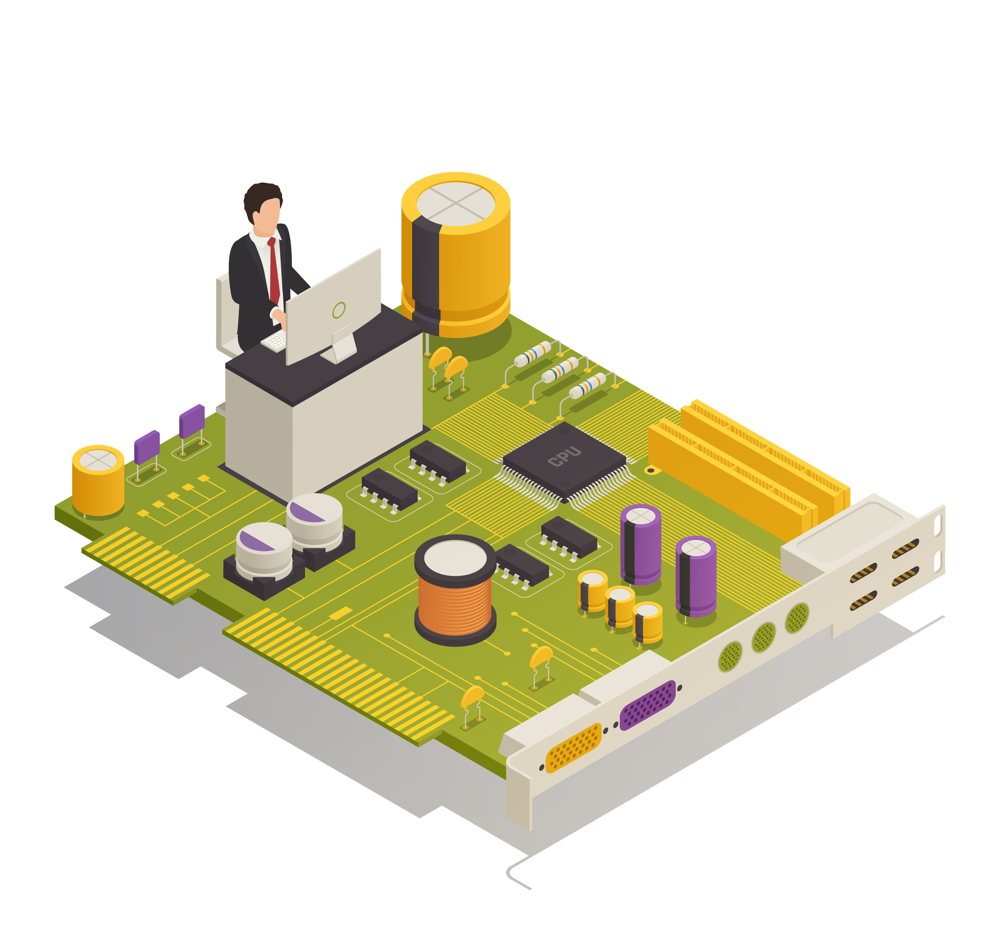

 
  <strong>Hi, Filipe here.</strong>
  Or you can call me Ender (comum nickname).

    
  I am an Eletronic Technitian, programmer from IOT to web.          I am studying  web development throught my projects down here.

  🦄 Skills: <strong>C++, JS, Python and Firebase.</strong>

🚀 Skills in progrss:<strong> Vue, manimlib, Faunadb, SQL+ and CSS.</strong>

🧰 Tools: Visual Studio Code, Figma, Notion, Git and GitHub.

  📫  Want to talk to me about projects or any douts? don't hesitate. 

  
  
  

  

  
